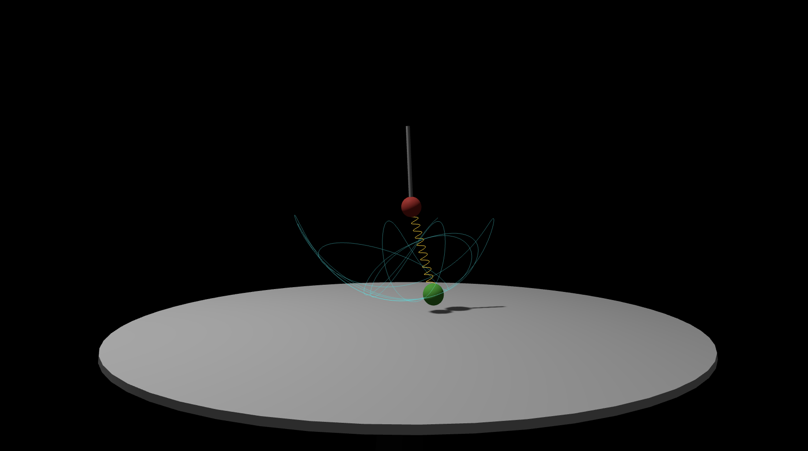

# Chaotisches 3D-Doppelpendel mit Spiralfeder

Eine physikalisch basierte Simulation eines Doppelpendels, bei dem der zweite Arm als elastische Spiralfeder implementiert ist. Die Simulation nutzt Three.js für die 3D-Visualisierung und ein Runge-Kutta-Verfahren 4. Ordnung (RK4) für die Berechnung der Dynamik.


*Hinweis: Erstelle einen Screenshot deines Browsers und speichere ihn als `screenshot.png` in diesem Verzeichnis.*

## Features

- **3D-Physik:** Simulation mit orthogonalen Schwingungsachsen (3D-Lagrange-Dynamik).
- **Federdynamik:** Die zweite Achse ist eine elastische Feder mit variabler Länge, Dämpfung und Federsteifigkeit.
- **RK4-Integrator:** Hochpräzise numerische Integration für stabiles chaotisches Verhalten.
- **Visualisierung:**
    - Animierte goldene Spiralfeder (Helix).
    - Dynamischer Trail (Spur) der Pendelmasse.
    - Echtzeit-Schattenwurf auf eine weiße Tischplatte.
    - Interaktive Kamera (OrbitControls).

## Installation & Start

Da die Anwendung in einer einzigen HTML-Datei gekapselt ist, ist keine Installation erforderlich.

1. Öffne die Datei `doppelpendel.html` direkt in einem modernen Webbrowser.
2. Alternativ kannst du einen lokalen Webserver starten:
   ```bash
   npx serve .
   ```

## Bedienung

- **Rotieren:** Linke Maustaste gedrückt halten und ziehen.
- **Zoomen:** Mausrad benutzen.
- **Verschieben:** Rechte Maustaste gedrückt halten und ziehen.

## Technische Details

- **Framework:** [Three.js](https://threejs.org/) (via CDN geladen).
- **Integration:** Runge-Kutta 4 (RK4) mit 40 Substeps pro Frame (bei 60 FPS) für maximale Stabilität.
- **Achsen:** Die erste Achse rotiert um die globale Z-Achse, die zweite Achse schwingt lokal orthogonal dazu.

---
Erstellt mit Hilfe von Gemini CLI.
